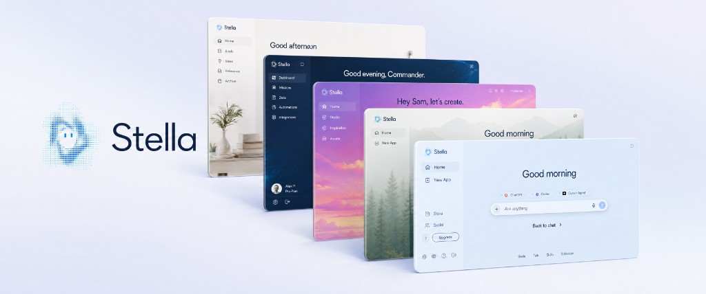

  

  <a href="https://stella.sh">stella.sh</a>

  

## Your personal assistant.

Stella is a local-first desktop assistant that can work with your files, browser,
apps, and computer. Ask a question, hand it a task, or let it split larger work
across background agents while you keep going.

### Install

Download the installer from [stella.sh](https://stella.sh). On macOS, open the
DMG and drag Stella into Applications. On Windows, run the NSIS installer. On
Arch Linux and Omarchy, download the native package and install it with
`sudo pacman -U ./Stella-*-ArchLinux-x64.pkg.tar.xz`. On other Linux
distributions, mark the AppImage executable and open it.

## Chats that stay manageable

Keep related work together, open another chat when the context changes, and
switch between active conversations without losing your place. Stella can run
background agents from any chat and bring their progress back inline.

## Personal from the start

Choose the models and providers you want, connect the services you use, and keep
the rest simple. Stella is useful out of the box without forcing every workflow
into a plugin or a separate mode.

## Open source. Local execution stays on your computer.

Stella is fully open source. Local agents run on your device, and local files and
runtime artifacts stay there unless you choose to upload, attach, or share them.
When you sign in, conversations, memory, Cloud Drive, and account settings sync
through Stella Cloud so they can follow you across devices. Managed model and
provider requests are processed by the services you choose. Bring any model you
already pay for, or use Stella's managed route if you'd rather not set anything
up.

## What Stella can do

- Background computer use (she can drive your Mac while you keep working)
- Browser use via the [Stella Chrome extension](https://chromewebstore.google.com/detail/stella-browser/kfnchfpocpmdblhfgcnpfaaebaioojnl)
- Word, Excel, PowerPoint, PDF
- Photo, video, audio, and 3D generation
- Dictation, both inside the app and anywhere else on your computer
- Realtime voice conversations
- Schedule things for later, including reminders and recurring tasks
- Store: share what you make, install what others have built
- Social: message friends, share and build apps together
- Text Stella from your phone, or from Discord, Telegram, and other apps. If you're signed in and your computer is on, your phone reaches your real Stella

## Zero setup

There is nothing to configure. Open Stella and start using her.

If you want to bring your own keys, you can. Use your Claude Code subscription, your OpenAI subscription, or any provider you already pay for.

If you'd rather not set anything up, an optional Stella subscription covers media generation, text messaging, and voice. Nothing is gated behind it. The subscription only exists so you don't have to think about API keys.

## Platforms

- macOS
- Windows (experimental)
- Linux x64 (beta), including Ubuntu and Omarchy/Arch with Hyprland

Linux releases include an AppImage plus a native Arch Linux package for Omarchy
and other Arch-based distributions. The native package installs Stella's menu
entry and its Git and GNOME Keyring dependencies through `pacman`, with no FUSE
setup required. Stella uses the system Git installation on Linux and a Secret
Service-compatible keyring for credential storage.

## Repository layout

- `packages/backend` — Convex backend
- `packages/mobile` — iOS / Android app
- `packages/desktop` and `packages/desktop-ui` — desktop application
- `packages/runtime` and `packages/contracts` — shared runtime and contracts
- `packages/website` — product website, account, billing, and Store surfaces

## Thanks

Stella stands on the shoulders of a lot of great open-source work. Special thanks to:

- [vercel-labs/agent-browser](https://github.com/vercel-labs/agent-browser)
- [anomalyco/opencode](https://github.com/anomalyco/opencode)
- [earendil-works/pi](https://github.com/earendil-works/pi)
- [NousResearch/hermes-agent](https://github.com/NousResearch/hermes-agent)
- [openclaw/openclaw](https://github.com/openclaw/openclaw)
- [iOfficeAI/OfficeCLI](https://github.com/iOfficeAI/OfficeCLI)
- [Codex](https://github.com/openai/codex)

## License

Stella is licensed under the [Apache License 2.0](./LICENSE).
